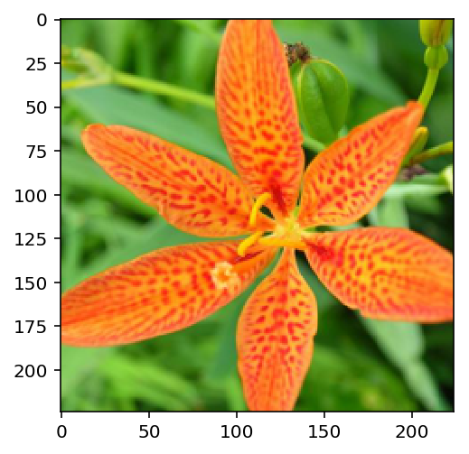
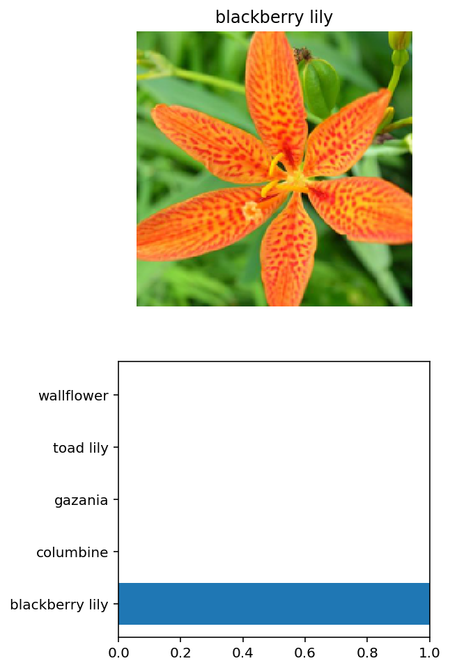

# Developing an AI application

Going forward, AI algorithms will be incorporated into more and more everyday applications. For example, you might want to include an image classifier in a smart phone app. To do this, you'd use a deep learning model trained on hundreds of thousands of images as part of the overall application architecture. A large part of software development in the future will be using these types of models as common parts of applications. 

In this project, you'll train an image classifier to recognize different species of flowers. You can imagine using something like this in a phone app that tells you the name of the flower your camera is looking at. In practice you'd train this classifier, then export it for use in your application. We'll be using [this dataset](http://www.robots.ox.ac.uk/~vgg/data/flowers/102/index.html) of 102 flower categories, you can see a few examples below. 


The project is broken down into multiple steps:

* Load and preprocess the image dataset
* Train the image classifier on your dataset
* Use the trained classifier to predict image content

When you've completed this project, you'll have an application that can be trained on any set of labeled images. Here your network will be learning about flowers and end up as a command line application. But, what you do with your new skills depends on your imagination and effort in building a dataset. For example, imagine an app where you take a picture of a car, it tells you what the make and model is, then looks up information about it. Go build your own dataset and make something new.

First up is importing the packages you'll need. It's good practice to keep all the imports at the beginning of your code. As you work through this notebook and find you need to import a package, make sure to add the import up here.

Please make sure if you are running this notebook in the workspace that you have chosen GPU rather than CPU mode.


```python
# Imports here
%matplotlib inline
%config InlineBackend.figure_format = 'retina'

import numpy as np
import matplotlib.pyplot as plt

import torch
from torch import nn, optim
import torch.nn.functional as F
from torchvision import datasets, transforms, models

import json
import copy

#leave session open for long comput. times:
from workspace_utils import active_session, keep_awake

from collections import OrderedDict

from PIL import Image

#import time

#import helper

```

## Load the data

Here you'll use `torchvision` to load the data ([documentation](http://pytorch.org/docs/0.3.0/torchvision/index.html)). The data should be included alongside this notebook, otherwise you can [download it here](https://s3.amazonaws.com/content.udacity-data.com/nd089/flower_data.tar.gz). The dataset is split into three parts, training, validation, and testing. For the training, you'll want to apply transformations such as random scaling, cropping, and flipping. This will help the network generalize leading to better performance. You'll also need to make sure the input data is resized to 224x224 pixels as required by the pre-trained networks.

The validation and testing sets are used to measure the model's performance on data it hasn't seen yet. For this you don't want any scaling or rotation transformations, but you'll need to resize then crop the images to the appropriate size.

The pre-trained networks you'll use were trained on the ImageNet dataset where each color channel was normalized separately. For all three sets you'll need to normalize the means and standard deviations of the images to what the network expects. For the means, it's `[0.485, 0.456, 0.406]` and for the standard deviations `[0.229, 0.224, 0.225]`, calculated from the ImageNet images.  These values will shift each color channel to be centered at 0 and range from -1 to 1.
 


```python
data_dir = 'flowers'
train_dir = data_dir + '/train'
valid_dir = data_dir + '/valid'
test_dir = data_dir + '/test'
```


```python
#Define your transforms for the training, validation, and testing sets
train_transforms = transforms.Compose([transforms.RandomRotation(40),
                                       transforms.RandomResizedCrop(224),
                                       transforms.RandomHorizontalFlip(),
                                       transforms.ToTensor()])
valid_transforms = transforms.Compose([transforms.Resize(225),
                                       transforms.CenterCrop(224),
                                       transforms.ToTensor(),
                                       transforms.Normalize([0.485, 0.456, 0.406],
                                                            [0.229, 0.224, 0.225])])
test_transforms = transforms.Compose([transforms.Resize(225),
                                       transforms.CenterCrop(224),
                                       transforms.ToTensor(),
                                       transforms.Normalize([0.485, 0.456, 0.406],
                                                            [0.229, 0.224, 0.225])])


#Load the datasets with ImageFolder
train_dataset = datasets.ImageFolder(train_dir, transform=train_transforms)
valid_dataset = datasets.ImageFolder(valid_dir, transform=valid_transforms)
test_dataset = datasets.ImageFolder(test_dir, transform=test_transforms)

#Using the image datasets and the trainforms, define the dataloaders
trainloader = torch.utils.data.DataLoader(train_dataset, batch_size=64, shuffle=True)
validloader = torch.utils.data.DataLoader(valid_dataset, batch_size=64)
testloader = torch.utils.data.DataLoader(test_dataset, batch_size=64)
```

### Label mapping

You'll also need to load in a mapping from category label to category name. You can find this in the file `cat_to_name.json`. It's a JSON object which you can read in with the [`json` module](https://docs.python.org/2/library/json.html). This will give you a dictionary mapping the integer encoded categories to the actual names of the flowers.


```python
with open('cat_to_name.json', 'r') as f:
    cat_to_name = json.load(f)
```

# Building and training the classifier

Now that the data is ready, it's time to build and train the classifier. As usual, you should use one of the pretrained models from `torchvision.models` to get the image features. Build and train a new feed-forward classifier using those features.

Things you'll need to do:

* Load a [pre-trained network](http://pytorch.org/docs/master/torchvision/models.html) (If you need a starting point, the VGG networks work great and are straightforward to use)
* Define a new, untrained feed-forward network as a classifier, using ReLU activations and dropout
* Train the classifier layers using backpropagation using the pre-trained network to get the features
* Track the loss and accuracy on the validation set to determine the best hyperparameters

When training make sure you're updating only the weights of the feed-forward network. You should be able to get the validation accuracy above 70% if you build everything right. Make sure to try different hyperparameters (learning rate, units in the classifier, epochs, etc) to find the best model. Save those hyperparameters to use as default values in the next part of the project.

One last important tip if you're using the workspace to run your code: To avoid having your workspace disconnect during the long-running tasks in this notebook, please read in the earlier page in this lesson called Intro to GPU Workspaces about Keeping Your Session Active. You'll want to include code from the workspace_utils.py module.


```python
#Build and train your network
#some pretrained models to choose from:
#model = models.resnet18(pretrained=True)
#model = models.alexnet(pretrained=True)
#model = models.squeezenet1_0(pretrained=True)
#model = models.vgg11(pretrained=True)
model = models.vgg13(pretrained=True)
#model = models.vgg16(pretrained=True)
#model = models.vgg16_bn(pretrained=True)
#model = models.vgg19(pretrained=True)
#model = models.densenet161(pretrained=True)
#model = models.densenet121(pretrained=True)
#model = models.inception_v3(pretrained=True)
model
```


    VGG(
      (features): Sequential(
        (0): Conv2d(3, 64, kernel_size=(3, 3), stride=(1, 1), padding=(1, 1))
        (1): ReLU(inplace)
        (2): Conv2d(64, 64, kernel_size=(3, 3), stride=(1, 1), padding=(1, 1))
        (3): ReLU(inplace)
        (4): MaxPool2d(kernel_size=2, stride=2, padding=0, dilation=1, ceil_mode=False)
        (5): Conv2d(64, 128, kernel_size=(3, 3), stride=(1, 1), padding=(1, 1))
        (6): ReLU(inplace)
        (7): Conv2d(128, 128, kernel_size=(3, 3), stride=(1, 1), padding=(1, 1))
        (8): ReLU(inplace)
        (9): MaxPool2d(kernel_size=2, stride=2, padding=0, dilation=1, ceil_mode=False)
        (10): Conv2d(128, 256, kernel_size=(3, 3), stride=(1, 1), padding=(1, 1))
        (11): ReLU(inplace)
        (12): Conv2d(256, 256, kernel_size=(3, 3), stride=(1, 1), padding=(1, 1))
        (13): ReLU(inplace)
        (14): MaxPool2d(kernel_size=2, stride=2, padding=0, dilation=1, ceil_mode=False)
        (15): Conv2d(256, 512, kernel_size=(3, 3), stride=(1, 1), padding=(1, 1))
        (16): ReLU(inplace)
        (17): Conv2d(512, 512, kernel_size=(3, 3), stride=(1, 1), padding=(1, 1))
        (18): ReLU(inplace)
        (19): MaxPool2d(kernel_size=2, stride=2, padding=0, dilation=1, ceil_mode=False)
        (20): Conv2d(512, 512, kernel_size=(3, 3), stride=(1, 1), padding=(1, 1))
        (21): ReLU(inplace)
        (22): Conv2d(512, 512, kernel_size=(3, 3), stride=(1, 1), padding=(1, 1))
        (23): ReLU(inplace)
        (24): MaxPool2d(kernel_size=2, stride=2, padding=0, dilation=1, ceil_mode=False)
      )
      (classifier): Sequential(
        (0): Linear(in_features=25088, out_features=4096, bias=True)
        (1): ReLU(inplace)
        (2): Dropout(p=0.5)
        (3): Linear(in_features=4096, out_features=4096, bias=True)
        (4): ReLU(inplace)
        (5): Dropout(p=0.5)
        (6): Linear(in_features=4096, out_features=1000, bias=True)
      )
    )


```python
#create the classifier part of the model to fit the number of categories (102):
#freeze parameters for feature part of model:
for param in model.parameters():
    param.requires_grad = False

n_hidden = 4000
dropout_frac = 0.1

classifier = nn.Sequential(OrderedDict([
                          ('fc1', nn.Linear(25088, n_hidden)),
                          ('relu', nn.ReLU()),
                          ('dropout', nn.Dropout(p=dropout_frac)),
                          ('fc2', nn.Linear(n_hidden, 102)),
                          ('output', nn.LogSoftmax(dim=1))
                          ]))

model.classifier = classifier
model
```


    VGG(
      (features): Sequential(
        (0): Conv2d(3, 64, kernel_size=(3, 3), stride=(1, 1), padding=(1, 1))
        (1): ReLU(inplace)
        (2): Conv2d(64, 64, kernel_size=(3, 3), stride=(1, 1), padding=(1, 1))
        (3): ReLU(inplace)
        (4): MaxPool2d(kernel_size=2, stride=2, padding=0, dilation=1, ceil_mode=False)
        (5): Conv2d(64, 128, kernel_size=(3, 3), stride=(1, 1), padding=(1, 1))
        (6): ReLU(inplace)
        (7): Conv2d(128, 128, kernel_size=(3, 3), stride=(1, 1), padding=(1, 1))
        (8): ReLU(inplace)
        (9): MaxPool2d(kernel_size=2, stride=2, padding=0, dilation=1, ceil_mode=False)
        (10): Conv2d(128, 256, kernel_size=(3, 3), stride=(1, 1), padding=(1, 1))
        (11): ReLU(inplace)
        (12): Conv2d(256, 256, kernel_size=(3, 3), stride=(1, 1), padding=(1, 1))
        (13): ReLU(inplace)
        (14): MaxPool2d(kernel_size=2, stride=2, padding=0, dilation=1, ceil_mode=False)
        (15): Conv2d(256, 512, kernel_size=(3, 3), stride=(1, 1), padding=(1, 1))
        (16): ReLU(inplace)
        (17): Conv2d(512, 512, kernel_size=(3, 3), stride=(1, 1), padding=(1, 1))
        (18): ReLU(inplace)
        (19): MaxPool2d(kernel_size=2, stride=2, padding=0, dilation=1, ceil_mode=False)
        (20): Conv2d(512, 512, kernel_size=(3, 3), stride=(1, 1), padding=(1, 1))
        (21): ReLU(inplace)
        (22): Conv2d(512, 512, kernel_size=(3, 3), stride=(1, 1), padding=(1, 1))
        (23): ReLU(inplace)
        (24): MaxPool2d(kernel_size=2, stride=2, padding=0, dilation=1, ceil_mode=False)
      )
      (classifier): Sequential(
        (fc1): Linear(in_features=25088, out_features=4000, bias=True)
        (relu): ReLU()
        (dropout): Dropout(p=0.1)
        (fc2): Linear(in_features=4000, out_features=102, bias=True)
        (output): LogSoftmax()
      )
    )


```python
#give the model a criterion and optimizer:
device = torch.device("cuda" if torch.cuda.is_available() else "cpu")
model.to(device)
lr = 0.0005
criterion = nn.NLLLoss()
optimizer = optim.Adam(model.classifier.parameters(), lr=lr)
```


```python
#pass some attributes to model
model.epochs = 0
model.class_to_idx = train_dataset.class_to_idx
optimizer.lr = lr
model.n_hidden = n_hidden
model.dropout_frac = dropout_frac
```


```python
def train_model(model, criterion, optimizer, epoch):
    '''train the model, then keep the model with the best accuracy with the copy module'''
    with active_session(): #for computations lasting more than 30 minutes, put code indented into this to keep session open
        device = torch.device("cuda" if torch.cuda.is_available() else "cpu")

        epoch_copy = model.epochs
        steps = 0
        running_loss = 0
        print_every = 5
        model.to(device);
        top_model = copy.deepcopy(model.state_dict())
        top_accuracy = 0.
        for ep in range(model.epochs+1, model.epochs+epoch+1, 1): #train the model with training set over x epochs
            for inputs, labels in trainloader:
                steps += 1
                # Move input and label tensors to the default device
                inputs, labels = inputs.to(device), labels.to(device)

                optimizer.zero_grad()

                logps = model.forward(inputs)
                loss = criterion(logps, labels)
                loss.backward()
                optimizer.step()

                running_loss += loss.item()

                if steps % print_every == 0: #every x steps, use validation set to check that model is learning
                    valid_loss = 0
                    accuracy = 0
                    model.eval()
                    with torch.no_grad():
                        for vinputs, vlabels in validloader:
                            vinputs, vlabels = vinputs.to(device), vlabels.to(device)
                            vlogps = model.forward(vinputs)
                            batch_loss = criterion(vlogps, vlabels)

                            valid_loss += batch_loss.item()

                            # Calculate accuracy
                            ps = torch.exp(vlogps)
                            top_p, top_class = ps.topk(1, dim=1)
                            equals = top_class == vlabels.view(*top_class.shape)
                            accuracy += torch.mean(equals.type(torch.FloatTensor)).item()
                            if accuracy > top_accuracy: #if new best model: copy it
                                top_accuracy = accuracy
                                top_model = copy.deepcopy(model.state_dict())
                                epoch_copy = ep

                    print(f"Epoch {ep}/{model.epochs + epoch}.. "
                          f"Train loss: {running_loss/print_every:.3f}.. "
                          f"Validation loss: {valid_loss/len(validloader):.3f}.. "
                          f"Validation accuracy: {accuracy/len(validloader):.3f}")
                    running_loss = 0
                    model.train()
        model.load_state_dict(top_model)
        #model.to('cpu')  
        model.epochs = epoch_copy
        return model, optimizer
```


```python
#train here: (following are some hyperparameters and the resulting accuracy at a given epoch) 
#vgg19 timeline 3500hu, 0.2 drop, 0.001lr: 47.7 e1, 52.4 e2, 59.2 e3, 63 total
#vgg13 1000hu, 0.1drop, 0.0008lr-0.0006: 63.9 e1, 64.8 e2, 74 max, 69.6 test max (e7)
#vgg13 1000hu, 0.3drop, 0.0008lr: 55 e1
#vgg13 200hu, 0.1drop, 0.0008lr: 54 e1
#vgg13 1000hu 0.1drop 0.0008lr: 56.5 e1
#vgg13 5000hu 0.1 drop 0.0008lr: 49 e1, 64 e2, 69 e3
#vgg13 5000hu 0.1 drop 0.002lr: 42 e1
#vgg13 4000hu 0.1 drop 0.0005lr: 58 e1, 68 e2, 65 e3
model, optimizer = train_model(model, criterion, optimizer, epoch=3)
```

    Epoch 1/3.. Train loss: 5.623.. Validation loss: 5.838.. Validation accuracy: 0.087
    Epoch 1/3.. Train loss: 5.102.. Validation loss: 4.732.. Validation accuracy: 0.136
    Epoch 1/3.. Train loss: 4.351.. Validation loss: 3.819.. Validation accuracy: 0.248
    Epoch 1/3.. Train loss: 3.613.. Validation loss: 3.388.. Validation accuracy: 0.262
    Epoch 1/3.. Train loss: 3.348.. Validation loss: 2.940.. Validation accuracy: 0.319
    Epoch 1/3.. Train loss: 2.938.. Validation loss: 2.885.. Validation accuracy: 0.355
    Epoch 1/3.. Train loss: 2.583.. Validation loss: 2.954.. Validation accuracy: 0.348
    Epoch 1/3.. Train loss: 2.631.. Validation loss: 2.360.. Validation accuracy: 0.433
    Epoch 1/3.. Train loss: 2.394.. Validation loss: 2.786.. Validation accuracy: 0.391
    Epoch 1/3.. Train loss: 2.346.. Validation loss: 2.259.. Validation accuracy: 0.470
    Epoch 1/3.. Train loss: 2.099.. Validation loss: 2.137.. Validation accuracy: 0.496
    Epoch 1/3.. Train loss: 1.928.. Validation loss: 2.142.. Validation accuracy: 0.484
    Epoch 1/3.. Train loss: 2.042.. Validation loss: 1.827.. Validation accuracy: 0.543
    Epoch 1/3.. Train loss: 1.874.. Validation loss: 1.818.. Validation accuracy: 0.525
    Epoch 1/3.. Train loss: 1.683.. Validation loss: 1.820.. Validation accuracy: 0.552
    Epoch 1/3.. Train loss: 1.855.. Validation loss: 2.053.. Validation accuracy: 0.524
    Epoch 1/3.. Train loss: 1.743.. Validation loss: 1.723.. Validation accuracy: 0.586
    Epoch 1/3.. Train loss: 1.650.. Validation loss: 1.649.. Validation accuracy: 0.605
    Epoch 1/3.. Train loss: 1.517.. Validation loss: 1.811.. Validation accuracy: 0.592
    Epoch 1/3.. Train loss: 1.640.. Validation loss: 1.743.. Validation accuracy: 0.584
    Epoch 2/3.. Train loss: 1.376.. Validation loss: 1.713.. Validation accuracy: 0.583
    Epoch 2/3.. Train loss: 1.428.. Validation loss: 1.573.. Validation accuracy: 0.618
    Epoch 2/3.. Train loss: 1.394.. Validation loss: 1.823.. Validation accuracy: 0.588
    Epoch 2/3.. Train loss: 1.279.. Validation loss: 2.001.. Validation accuracy: 0.543
    Epoch 2/3.. Train loss: 1.252.. Validation loss: 1.848.. Validation accuracy: 0.596
    Epoch 2/3.. Train loss: 1.252.. Validation loss: 1.725.. Validation accuracy: 0.601
    Epoch 2/3.. Train loss: 1.191.. Validation loss: 1.858.. Validation accuracy: 0.566
    Epoch 2/3.. Train loss: 1.145.. Validation loss: 1.846.. Validation accuracy: 0.586
    Epoch 2/3.. Train loss: 1.214.. Validation loss: 1.657.. Validation accuracy: 0.618
    Epoch 2/3.. Train loss: 1.179.. Validation loss: 1.511.. Validation accuracy: 0.649
    Epoch 2/3.. Train loss: 1.182.. Validation loss: 1.837.. Validation accuracy: 0.592
    Epoch 2/3.. Train loss: 1.216.. Validation loss: 1.815.. Validation accuracy: 0.598
    Epoch 2/3.. Train loss: 1.150.. Validation loss: 1.812.. Validation accuracy: 0.612
    Epoch 2/3.. Train loss: 1.353.. Validation loss: 1.448.. Validation accuracy: 0.666
    Epoch 2/3.. Train loss: 1.175.. Validation loss: 1.557.. Validation accuracy: 0.642
    Epoch 2/3.. Train loss: 1.254.. Validation loss: 1.612.. Validation accuracy: 0.647
    Epoch 2/3.. Train loss: 1.254.. Validation loss: 1.555.. Validation accuracy: 0.642
    Epoch 2/3.. Train loss: 1.020.. Validation loss: 1.688.. Validation accuracy: 0.629
    Epoch 2/3.. Train loss: 0.994.. Validation loss: 1.541.. Validation accuracy: 0.642
    Epoch 2/3.. Train loss: 1.108.. Validation loss: 1.424.. Validation accuracy: 0.669
    Epoch 2/3.. Train loss: 1.116.. Validation loss: 1.412.. Validation accuracy: 0.685
    Epoch 3/3.. Train loss: 1.181.. Validation loss: 1.377.. Validation accuracy: 0.687
    Epoch 3/3.. Train loss: 1.010.. Validation loss: 1.654.. Validation accuracy: 0.638
    Epoch 3/3.. Train loss: 0.926.. Validation loss: 1.743.. Validation accuracy: 0.641
    Epoch 3/3.. Train loss: 1.118.. Validation loss: 1.468.. Validation accuracy: 0.669
    Epoch 3/3.. Train loss: 1.039.. Validation loss: 1.512.. Validation accuracy: 0.662
    Epoch 3/3.. Train loss: 0.903.. Validation loss: 1.645.. Validation accuracy: 0.659
    Epoch 3/3.. Train loss: 1.089.. Validation loss: 1.510.. Validation accuracy: 0.663
    Epoch 3/3.. Train loss: 0.990.. Validation loss: 1.554.. Validation accuracy: 0.665
    Epoch 3/3.. Train loss: 0.982.. Validation loss: 1.537.. Validation accuracy: 0.665
    Epoch 3/3.. Train loss: 0.959.. Validation loss: 1.397.. Validation accuracy: 0.672
    Epoch 3/3.. Train loss: 0.949.. Validation loss: 1.546.. Validation accuracy: 0.661
    Epoch 3/3.. Train loss: 0.949.. Validation loss: 1.639.. Validation accuracy: 0.664
    Epoch 3/3.. Train loss: 1.074.. Validation loss: 1.429.. Validation accuracy: 0.685
    Epoch 3/3.. Train loss: 0.859.. Validation loss: 1.440.. Validation accuracy: 0.700
    Epoch 3/3.. Train loss: 0.908.. Validation loss: 1.385.. Validation accuracy: 0.703
    Epoch 3/3.. Train loss: 0.892.. Validation loss: 1.392.. Validation accuracy: 0.715
    Epoch 3/3.. Train loss: 1.036.. Validation loss: 1.334.. Validation accuracy: 0.716
    Epoch 3/3.. Train loss: 0.932.. Validation loss: 1.481.. Validation accuracy: 0.674
    Epoch 3/3.. Train loss: 0.922.. Validation loss: 1.533.. Validation accuracy: 0.664
    Epoch 3/3.. Train loss: 0.795.. Validation loss: 1.620.. Validation accuracy: 0.656


## Testing your network

It's good practice to test your trained network on test data, images the network has never seen either in training or validation. This will give you a good estimate for the model's performance on completely new images. Run the test images through the network and measure the accuracy, the same way you did validation. You should be able to reach around 70% accuracy on the test set if the model has been trained well.


```python
#Do validation on the test set
def test_model(model, criterion):
    test_loss = 0
    accuracy = 0
    device = torch.device("cuda" if torch.cuda.is_available() else "cpu")
    model.to(device)
    model.eval()
    with torch.no_grad():
        for inputs, labels in testloader:
            inputs, labels = inputs.to(device), labels.to(device)
            logps = model.forward(inputs)
            batch_loss = criterion(logps, labels)

            test_loss += batch_loss.item()

            # Calculate accuracy
            ps = torch.exp(logps)
            top_p, top_class = ps.topk(1, dim=1)
            equals = top_class == labels.view(*top_class.shape)
            accuracy += torch.mean(equals.type(torch.FloatTensor)).item()

    print(f"Test results.. "
    f"Test loss: {test_loss/len(testloader):.3f}.. "
    f"Test accuracy: {accuracy/len(testloader):.3f}")
    #model.to('cpu') 
    model.train()
```


```python
#test here
test_model(model, criterion)
```

    Test results.. Test loss: 1.672.. Test accuracy: 0.667


## Save the checkpoint

Now that your network is trained, save the model so you can load it later for making predictions. You probably want to save other things such as the mapping of classes to indices which you get from one of the image datasets: `image_datasets['train'].class_to_idx`. You can attach this to the model as an attribute which makes inference easier later on.

```model.class_to_idx = image_datasets['train'].class_to_idx```

Remember that you'll want to completely rebuild the model later so you can use it for inference. Make sure to include any information you need in the checkpoint. If you want to load the model and keep training, you'll want to save the number of epochs as well as the optimizer state, `optimizer.state_dict`. You'll likely want to use this trained model in the next part of the project, so best to save it now.


```python
#Save the checkpoint, don't forget to put it back to the cpu
def save_checkpoint(model, optimizer, filepath):
    #model.to('cpu')
    checkpoint = {'input_size': [3, 224, 224],
              'batch_size': trainloader.batch_size,
              'output_size': 102,
              'state_dict': model.state_dict(),
              'optimizer_dict':optimizer.state_dict(),
              'class_to_idx': model.class_to_idx,
              'epoch': model.epochs,
               'learning_rate': optimizer.lr,
                 'hidden_units': model.n_hidden,
                 'dropout_fraction': model.dropout_frac}

    torch.save(checkpoint, filepath)
```


```python
save_checkpoint(model, optimizer, filepath='checkpoint_vgg13.pth')
```

## Loading the checkpoint

At this point it's good to write a function that can load a checkpoint and rebuild the model. That way you can come back to this project and keep working on it without having to retrain the network.


```python
#Write a function that loads a checkpoint and rebuilds the model
def load_checkpoint(filepath):
    checkpoint = torch.load(filepath)
    
    #create imageloaders
    data_dir = 'flowers'
    train_dir = data_dir + '/train'
    valid_dir = data_dir + '/valid'
    test_dir = data_dir + '/test'
    
    train_transforms = transforms.Compose([transforms.RandomRotation(40),
                                       transforms.RandomResizedCrop(checkpoint['input_size'][2]),
                                       transforms.RandomHorizontalFlip(),
                                       transforms.ToTensor()])
    valid_transforms = transforms.Compose([transforms.Resize(checkpoint['input_size'][2]+1),
                                           transforms.CenterCrop(checkpoint['input_size'][2]),
                                           transforms.ToTensor(),
                                           transforms.Normalize([0.485, 0.456, 0.406],
                                                                [0.229, 0.224, 0.225])])
    test_transforms = transforms.Compose([transforms.Resize(checkpoint['input_size'][2]+1),
                                           transforms.CenterCrop(checkpoint['input_size'][2]),
                                           transforms.ToTensor(),
                                           transforms.Normalize([0.485, 0.456, 0.406],
                                                                [0.229, 0.224, 0.225])])

    train_dataset = datasets.ImageFolder(train_dir, transform=train_transforms)
    valid_dataset = datasets.ImageFolder(valid_dir, transform=valid_transforms)
    test_dataset = datasets.ImageFolder(test_dir, transform=test_transforms)

    trainloader = torch.utils.data.DataLoader(train_dataset, batch_size=checkpoint['batch_size'], shuffle=True)
    validloader = torch.utils.data.DataLoader(valid_dataset, batch_size=checkpoint['batch_size'])
    testloader = torch.utils.data.DataLoader(test_dataset, batch_size=checkpoint['batch_size'])
        
    model = models.vgg13(pretrained=True)
    device = torch.device("cuda" if torch.cuda.is_available() else "cpu")
    for param in model.parameters():
        param.requires_grad = False
    classifier = nn.Sequential(OrderedDict([
                          ('fc1', nn.Linear(25088, checkpoint['hidden_units'])),
                          ('relu', nn.ReLU()),
                          ('dropout', nn.Dropout(p=checkpoint['dropout_fraction'])),
                          ('fc2', nn.Linear(checkpoint['hidden_units'], checkpoint['output_size'])),
                          ('output', nn.LogSoftmax(dim=1))
                          ]))
    model.classifier = classifier
    model.load_state_dict(checkpoint['state_dict'])
    model.to(device)
    criterion = nn.NLLLoss()
    optimizer = optim.Adam(model.classifier.parameters(), lr=checkpoint['learning_rate'])
    optimizer.load_state_dict(checkpoint['optimizer_dict'])
    for state in optimizer.state.values():
        for k, v in state.items():
            if torch.is_tensor(v):
                state[k] = v.to(device)
    
    model.class_to_idx = checkpoint['class_to_idx']
    model.epochs = checkpoint['epoch']
    optimizer.lr = checkpoint['learning_rate']
    model.n_hidden = checkpoint['hidden_units']
    model.dropout_frac = checkpoint['dropout_fraction']
    return model, optimizer, criterion #also returns the criterion, optimizer and epochs
    
```


```python
#load checkpoint 
model, optimizer, criterion = load_checkpoint('checkpoint_vgg13.pth')
```


```python
#keep training model, save your progress:
optimizer.lr = 0.00045
for param_group in optimizer.param_groups:
        param_group['lr'] = 0.00045
model, optimizer = train_model(model, criterion, optimizer, epoch=2)
save_checkpoint(model, optimizer, filepath='checkpoint_vgg13.pth')
```

    Epoch 4/5.. Train loss: 0.860.. Validation loss: 1.383.. Validation accuracy: 0.710
    Epoch 4/5.. Train loss: 0.949.. Validation loss: 1.355.. Validation accuracy: 0.707
    Epoch 4/5.. Train loss: 0.767.. Validation loss: 1.401.. Validation accuracy: 0.702
    Epoch 4/5.. Train loss: 0.835.. Validation loss: 1.691.. Validation accuracy: 0.672
    Epoch 4/5.. Train loss: 1.107.. Validation loss: 1.648.. Validation accuracy: 0.674
    Epoch 4/5.. Train loss: 0.935.. Validation loss: 1.665.. Validation accuracy: 0.667
    Epoch 4/5.. Train loss: 0.921.. Validation loss: 1.668.. Validation accuracy: 0.666
    Epoch 4/5.. Train loss: 0.789.. Validation loss: 1.593.. Validation accuracy: 0.688
    Epoch 4/5.. Train loss: 0.770.. Validation loss: 1.668.. Validation accuracy: 0.674
    Epoch 4/5.. Train loss: 0.800.. Validation loss: 1.588.. Validation accuracy: 0.678
    Epoch 4/5.. Train loss: 0.816.. Validation loss: 1.530.. Validation accuracy: 0.688
    Epoch 4/5.. Train loss: 0.900.. Validation loss: 1.550.. Validation accuracy: 0.691
    Epoch 4/5.. Train loss: 0.783.. Validation loss: 1.442.. Validation accuracy: 0.701
    Epoch 4/5.. Train loss: 0.824.. Validation loss: 1.493.. Validation accuracy: 0.695
    Epoch 4/5.. Train loss: 0.866.. Validation loss: 1.506.. Validation accuracy: 0.691
    Epoch 4/5.. Train loss: 0.776.. Validation loss: 1.454.. Validation accuracy: 0.706
    Epoch 4/5.. Train loss: 0.728.. Validation loss: 1.444.. Validation accuracy: 0.701
    Epoch 4/5.. Train loss: 0.692.. Validation loss: 1.457.. Validation accuracy: 0.702
    Epoch 4/5.. Train loss: 0.855.. Validation loss: 1.445.. Validation accuracy: 0.707
    Epoch 4/5.. Train loss: 0.943.. Validation loss: 1.410.. Validation accuracy: 0.715
    Epoch 5/5.. Train loss: 0.846.. Validation loss: 1.217.. Validation accuracy: 0.730
    Epoch 5/5.. Train loss: 0.866.. Validation loss: 1.423.. Validation accuracy: 0.695
    Epoch 5/5.. Train loss: 0.779.. Validation loss: 1.515.. Validation accuracy: 0.678
    Epoch 5/5.. Train loss: 0.893.. Validation loss: 1.460.. Validation accuracy: 0.697
    Epoch 5/5.. Train loss: 0.660.. Validation loss: 1.429.. Validation accuracy: 0.702
    Epoch 5/5.. Train loss: 0.673.. Validation loss: 1.444.. Validation accuracy: 0.705
    Epoch 5/5.. Train loss: 0.628.. Validation loss: 1.455.. Validation accuracy: 0.711
    Epoch 5/5.. Train loss: 0.855.. Validation loss: 1.451.. Validation accuracy: 0.703
    Epoch 5/5.. Train loss: 0.745.. Validation loss: 1.467.. Validation accuracy: 0.697
    Epoch 5/5.. Train loss: 0.727.. Validation loss: 1.650.. Validation accuracy: 0.687
    Epoch 5/5.. Train loss: 0.763.. Validation loss: 1.652.. Validation accuracy: 0.690
    Epoch 5/5.. Train loss: 0.766.. Validation loss: 1.518.. Validation accuracy: 0.702
    Epoch 5/5.. Train loss: 0.829.. Validation loss: 1.618.. Validation accuracy: 0.692
    Epoch 5/5.. Train loss: 0.928.. Validation loss: 1.622.. Validation accuracy: 0.680
    Epoch 5/5.. Train loss: 0.877.. Validation loss: 1.577.. Validation accuracy: 0.670
    Epoch 5/5.. Train loss: 0.853.. Validation loss: 1.488.. Validation accuracy: 0.673
    Epoch 5/5.. Train loss: 0.738.. Validation loss: 1.508.. Validation accuracy: 0.679
    Epoch 5/5.. Train loss: 0.735.. Validation loss: 1.561.. Validation accuracy: 0.680
    Epoch 5/5.. Train loss: 0.711.. Validation loss: 1.649.. Validation accuracy: 0.668
    Epoch 5/5.. Train loss: 0.717.. Validation loss: 1.618.. Validation accuracy: 0.672
    Epoch 5/5.. Train loss: 0.721.. Validation loss: 1.610.. Validation accuracy: 0.674


```python
#retest here
test_model(model, criterion)
```

    Test results.. Test loss: 1.593.. Test accuracy: 0.682


```python
#still need more training to reach 70, lower learning rate%
optimizer.lr = 0.0004
for param_group in optimizer.param_groups:
        param_group['lr'] = 0.0004
model, optimizer = train_model(model, criterion, optimizer, epoch=1)
save_checkpoint(model, optimizer, filepath='checkpoint_vgg13.pth')

```

    Epoch 6/6.. Train loss: 0.804.. Validation loss: 1.231.. Validation accuracy: 0.738
    Epoch 6/6.. Train loss: 0.736.. Validation loss: 1.327.. Validation accuracy: 0.716
    Epoch 6/6.. Train loss: 0.689.. Validation loss: 1.439.. Validation accuracy: 0.689
    Epoch 6/6.. Train loss: 0.708.. Validation loss: 1.427.. Validation accuracy: 0.699
    Epoch 6/6.. Train loss: 0.849.. Validation loss: 1.281.. Validation accuracy: 0.721
    Epoch 6/6.. Train loss: 0.775.. Validation loss: 1.365.. Validation accuracy: 0.702
    Epoch 6/6.. Train loss: 0.809.. Validation loss: 1.461.. Validation accuracy: 0.696
    Epoch 6/6.. Train loss: 0.673.. Validation loss: 1.418.. Validation accuracy: 0.710
    Epoch 6/6.. Train loss: 0.712.. Validation loss: 1.282.. Validation accuracy: 0.732
    Epoch 6/6.. Train loss: 0.690.. Validation loss: 1.174.. Validation accuracy: 0.740
    Epoch 6/6.. Train loss: 0.685.. Validation loss: 1.405.. Validation accuracy: 0.715
    Epoch 6/6.. Train loss: 0.904.. Validation loss: 1.814.. Validation accuracy: 0.652
    Epoch 6/6.. Train loss: 0.719.. Validation loss: 1.691.. Validation accuracy: 0.674
    Epoch 6/6.. Train loss: 0.774.. Validation loss: 1.558.. Validation accuracy: 0.683
    Epoch 6/6.. Train loss: 0.787.. Validation loss: 1.463.. Validation accuracy: 0.700
    Epoch 6/6.. Train loss: 0.782.. Validation loss: 1.443.. Validation accuracy: 0.702
    Epoch 6/6.. Train loss: 0.807.. Validation loss: 1.419.. Validation accuracy: 0.715
    Epoch 6/6.. Train loss: 0.677.. Validation loss: 1.442.. Validation accuracy: 0.702
    Epoch 6/6.. Train loss: 0.829.. Validation loss: 1.565.. Validation accuracy: 0.703
    Epoch 6/6.. Train loss: 0.828.. Validation loss: 1.704.. Validation accuracy: 0.675


```python
#retest here (70.9% accuracy, we finally did it!)
test_model(model, criterion)
```

    Test results.. Test loss: 1.419.. Test accuracy: 0.709


# Inference for classification

Now you'll write a function to use a trained network for inference. That is, you'll pass an image into the network and predict the class of the flower in the image. Write a function called `predict` that takes an image and a model, then returns the top $K$ most likely classes along with the probabilities. It should look like 

```python
probs, classes = predict(image_path, model)
print(probs)
print(classes)
> [ 0.01558163  0.01541934  0.01452626  0.01443549  0.01407339]
> ['70', '3', '45', '62', '55']
```

First you'll need to handle processing the input image such that it can be used in your network. 

## Image Preprocessing

You'll want to use `PIL` to load the image ([documentation](https://pillow.readthedocs.io/en/latest/reference/Image.html)). It's best to write a function that preprocesses the image so it can be used as input for the model. This function should process the images in the same manner used for training. 

First, resize the images where the shortest side is 256 pixels, keeping the aspect ratio. This can be done with the [`thumbnail`](http://pillow.readthedocs.io/en/3.1.x/reference/Image.html#PIL.Image.Image.thumbnail) or [`resize`](http://pillow.readthedocs.io/en/3.1.x/reference/Image.html#PIL.Image.Image.thumbnail) methods. Then you'll need to crop out the center 224x224 portion of the image.

Color channels of images are typically encoded as integers 0-255, but the model expected floats 0-1. You'll need to convert the values. It's easiest with a Numpy array, which you can get from a PIL image like so `np_image = np.array(pil_image)`.

As before, the network expects the images to be normalized in a specific way. For the means, it's `[0.485, 0.456, 0.406]` and for the standard deviations `[0.229, 0.224, 0.225]`. You'll want to subtract the means from each color channel, then divide by the standard deviation. 

And finally, PyTorch expects the color channel to be the first dimension but it's the third dimension in the PIL image and Numpy array. You can reorder dimensions using [`ndarray.transpose`](https://docs.scipy.org/doc/numpy-1.13.0/reference/generated/numpy.ndarray.transpose.html). The color channel needs to be first and retain the order of the other two dimensions.


```python
def process_image(image):
    ''' Scales, crops, and normalizes a PIL image for a PyTorch model,
        returns an Numpy array
    '''
    # TODO: Process a PIL image for use in a PyTorch model
    im = Image.open(image)
    size = round(max(im.size)/min(im.size)*256.)
    im.thumbnail((size, size))
    width, height = im.size
    left = (width - 224)/2
    upper = (height - 224)/2
    right = (width + 224)/2
    lower = (height + 224)/2

    np_im = np.array(im.crop((left,upper,right,lower))) /255
    #fig, ax = plt.subplots()
    #ax.imshow(np_im * 1.)
    #print(np_im)
    mean = np.array([0.485, 0.456, 0.406])
    sd = np.array([0.229, 0.224, 0.225])
    np_im = (np_im - mean) / sd
    np_im = np_im.transpose((2,0,1))
    
    return np_im

```

To check your work, the function below converts a PyTorch tensor and displays it in the notebook. If your `process_image` function works, running the output through this function should return the original image (except for the cropped out portions).


```python
def imshow(image, ax=None, title=None):
    if ax is None:
        fig, ax = plt.subplots()
    
    # PyTorch tensors assume the color channel is the first dimension
    # but matplotlib assumes is the third dimension
    image = image.transpose((1, 2, 0))
    
    # Undo preprocessing
    mean = np.array([0.485, 0.456, 0.406])
    std = np.array([0.229, 0.224, 0.225])
    image = std * image + mean
    #print(image)
    # Image needs to be clipped between 0 and 1 or it looks like noise when displayed
    image = np.clip(image, 0, 1)
    if title != None:
        ax.set_title(title)
    ax.imshow(image)
    
    return ax

#test with an example:
imshow(process_image("flowers/test/102/image_08004.jpg"))
```


    <matplotlib.axes._subplots.AxesSubplot at 0x7fb83d06c3c8>





## Class Prediction

Once you can get images in the correct format, it's time to write a function for making predictions with your model. A common practice is to predict the top 5 or so (usually called top-$K$) most probable classes. You'll want to calculate the class probabilities then find the $K$ largest values.

To get the top $K$ largest values in a tensor use [`x.topk(k)`](http://pytorch.org/docs/master/torch.html#torch.topk). This method returns both the highest `k` probabilities and the indices of those probabilities corresponding to the classes. You need to convert from these indices to the actual class labels using `class_to_idx` which hopefully you added to the model or from an `ImageFolder` you used to load the data ([see here](#Save-the-checkpoint)). Make sure to invert the dictionary so you get a mapping from index to class as well.

Again, this method should take a path to an image and a model checkpoint, then return the probabilities and classes.

```python
probs, classes = predict(image_path, model)
print(probs)
print(classes)
> [ 0.01558163  0.01541934  0.01452626  0.01443549  0.01407339]
> ['70', '3', '45', '62', '55']
```


```python
def predict(image_path, checkpoint, topk=5):
    ''' Predict the class (or classes) of an image using a trained deep learning model.
    '''
    
    #Implement the code to predict the class from an image file
    model, optimizer, criterion = load_checkpoint(checkpoint)
    model.eval()
    device = torch.device("cuda" if torch.cuda.is_available() else "cpu")
    model.to(device)
    with torch.no_grad():
        image = process_image(image_path)
        image = torch.from_numpy(image)
        image = image.type(torch.FloatTensor)
        image.unsqueeze_(0) #adds batch size of 1 (extra dimension to tensor at position 0)
        image = image.to(device)
        logps = model.forward(image)
        ps = torch.exp(logps)
        top_p, top_idx = ps.topk(topk, dim=1)
    top_p = np.squeeze(top_p.cpu().numpy())
    top_idx = np.squeeze(top_idx.cpu().numpy())
    idx_to_class = {value: key for key, value in model.class_to_idx.items()}
    top_class = [idx_to_class[idx] for idx in top_idx]
    model.train()
    #model.to('cpu')

    return top_p, top_class

#test with an example:
probs, classes = predict("flowers/test/102/image_08004.jpg", 'checkpoint_vgg13.pth')
print(probs)
print(classes)
    
```

    [  1.00000000e+00   1.88794705e-12   6.57075539e-16   4.08560625e-16
       3.62592067e-16]
    ['102', '79', '84', '46', '71']


## Sanity Checking

Now that you can use a trained model for predictions, check to make sure it makes sense. Even if the testing accuracy is high, it's always good to check that there aren't obvious bugs. Use `matplotlib` to plot the probabilities for the top 5 classes as a bar graph, along with the input image. It should look like this:


You can convert from the class integer encoding to actual flower names with the `cat_to_name.json` file (should have been loaded earlier in the notebook). To show a PyTorch tensor as an image, use the `imshow` function defined above.


```python
#Display an image along with the top 5 classes
def sanity_check(image):
    probs, classes = predict(image, 'checkpoint_vgg13.pth')
    f, axarr = plt.subplots(2, figsize = (4,8))
    cat = image.split('/')[2]
    title = cat_to_name[cat]
    imshow(process_image(image), axarr[0], title)
    axarr[0].set_axis_off()
    names = [cat_to_name[cat] for cat in classes]
    axarr[1]=plt.barh(names, probs)
    plt.xlim(0,1)
    
    
#test it:
sanity_check("flowers/test/102/image_08004.jpg")

```





```python

```
